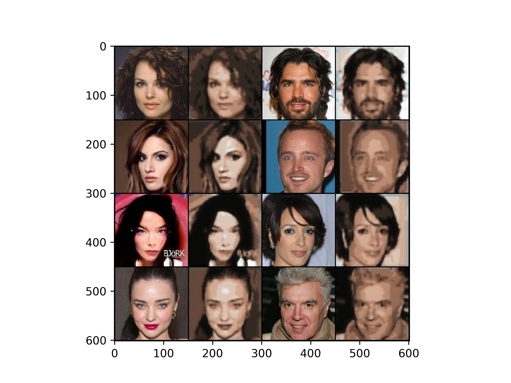
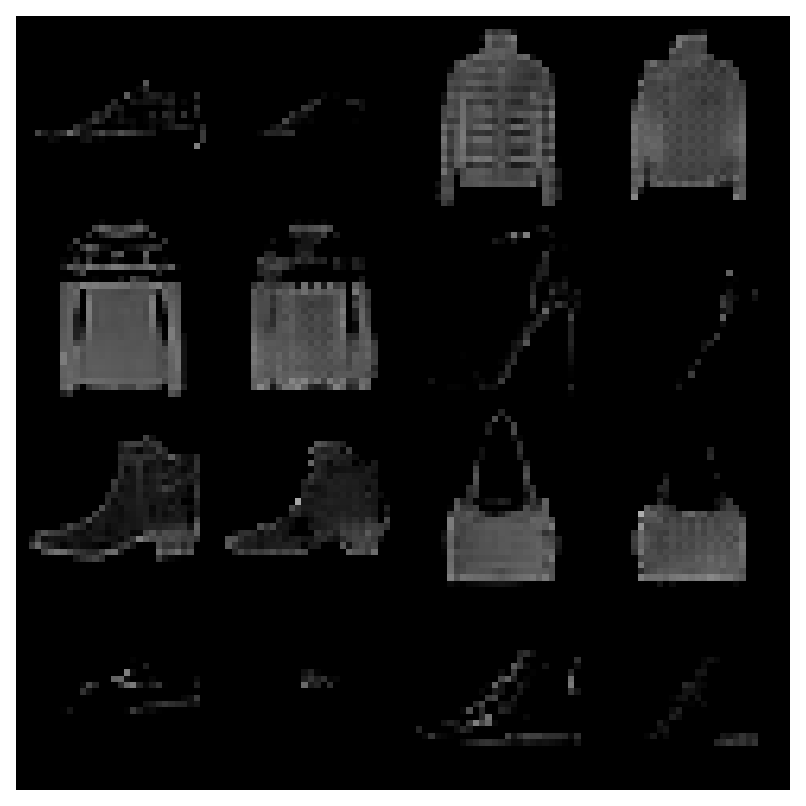
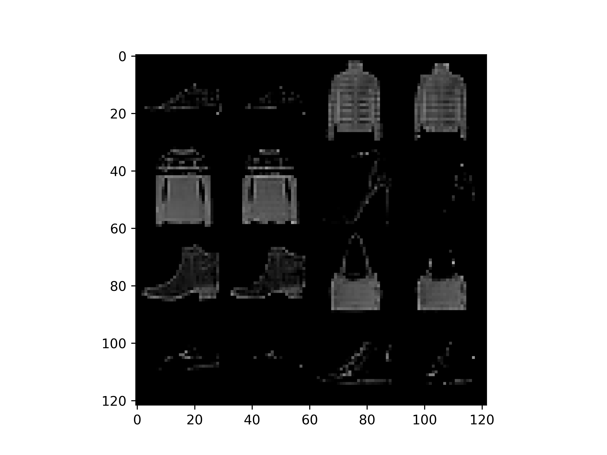

# LL-VQ-VAE

To replicate paper results simply run:
```
./run.sh
```

You may need to download Celeb-A yourself, but FFHQ-1024 and FashionMNIST are automatically handled.

# Pretrained checkpoints
To evaluate a pretrained model you have to specify the dataset and quantizer types as so:
```
python evaluate_checkpoint.py dataset='ffhq1024' quantizer='dense_lattice'
```

We include pretrained checkpoints for all datasets and quantizer types in the `pretrained` directory. We also showcase the results below. We calculate the codebook size by quantizing the entire dataset and counting the number of unique quantized vectors. This method was used since the lattice codebook isn't stored explicitly.

You'll notice that we do not compute the codebook size for the dense lattice quantizer. This is because the quantizer assigns each vector to a unique codebook entry, so the codebook size is equal to the number of vectors in the dataset, which is too large to count. This is also why the dense lattice reconstructions are superior to the other quantizers as it effictively has an infinite codebook size (doesn't really quantize).

For all results below the desired codebook size is 512. The learnable lattice uses that number to initialize its structure however the codebook size is not fixed and can grow or shrink during training.

| Dataset      | Quantizer       | Reconstruction                                                                    | Effective codebook size | Number of quantized vectors |
|--------------|-----------------|-----------------------------------------------------------------------------------|-------------------------|-----------------------------|
| FFHQ-1024    | VQ-VAE          |                                    | 28                      | 4,587,520,000               |
| FFHQ-1024    | LL-VQ-VAE       |            | 231                     | 4,587,520,000               |
| FFHQ-1024    | Dense LL-VQ-VAE |                      | 4,587,520,000           | 4,587,520,000               |
| Celeb-A      | VQ-VAE          |                                        | 19                      | 1,000,120,212               |
| Celeb-A      | LL-VQ-VAE       |                | 858                     | 1,000,120,212               |
| Celeb-A      | Dense LL-VQ-VAE |                          | 1,000,120,212           | 1,000,120,212               |
| FashionMNIST | VQ-VAE          |                          | 17                      | 11,760,000                  |
| FashionMNIST | LL-VQ-VAE       |  | 457                     | 11,760,000                  |
| FashionMNIST | Dense LL-VQ-VAE |            | 11,760,000              | 11,760,000                  |