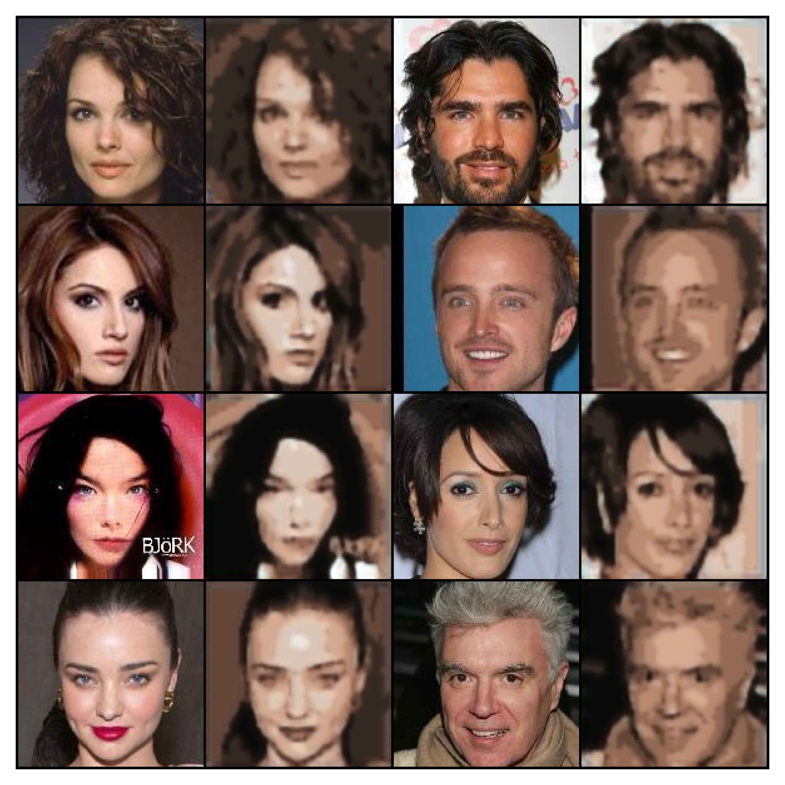
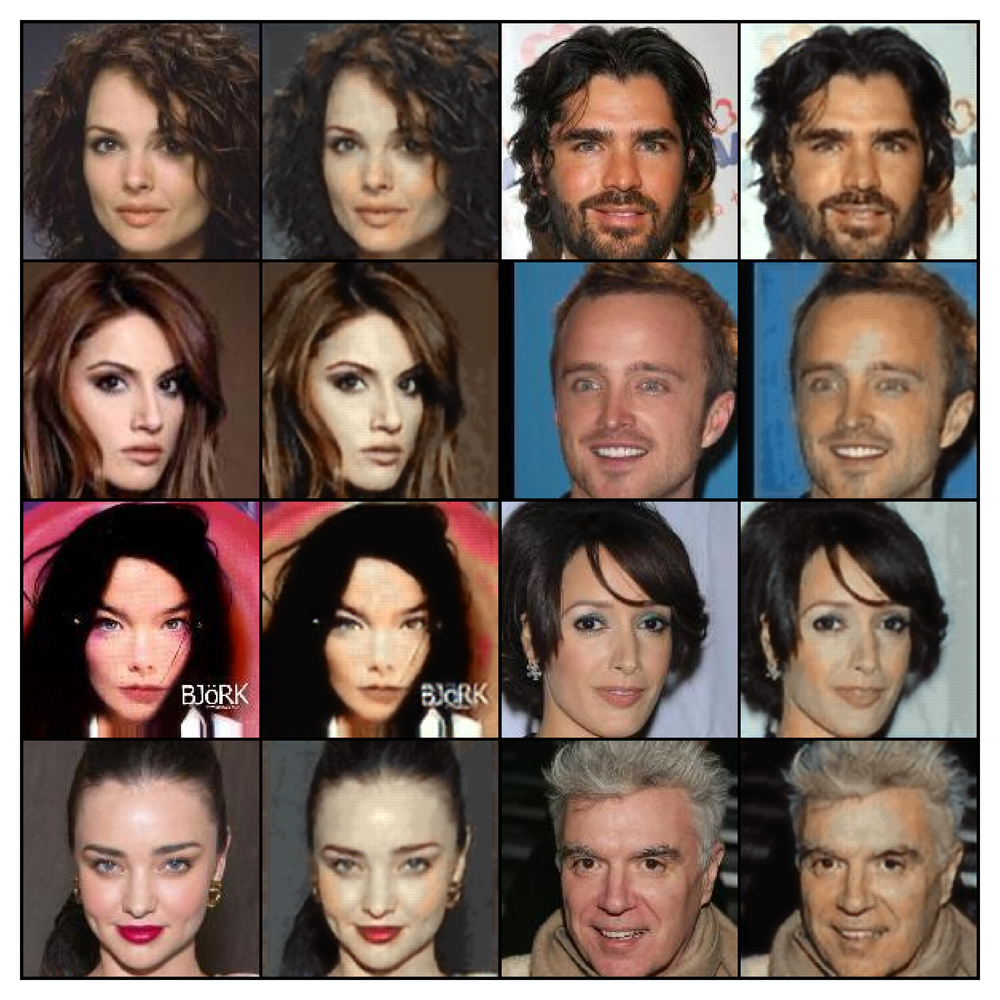
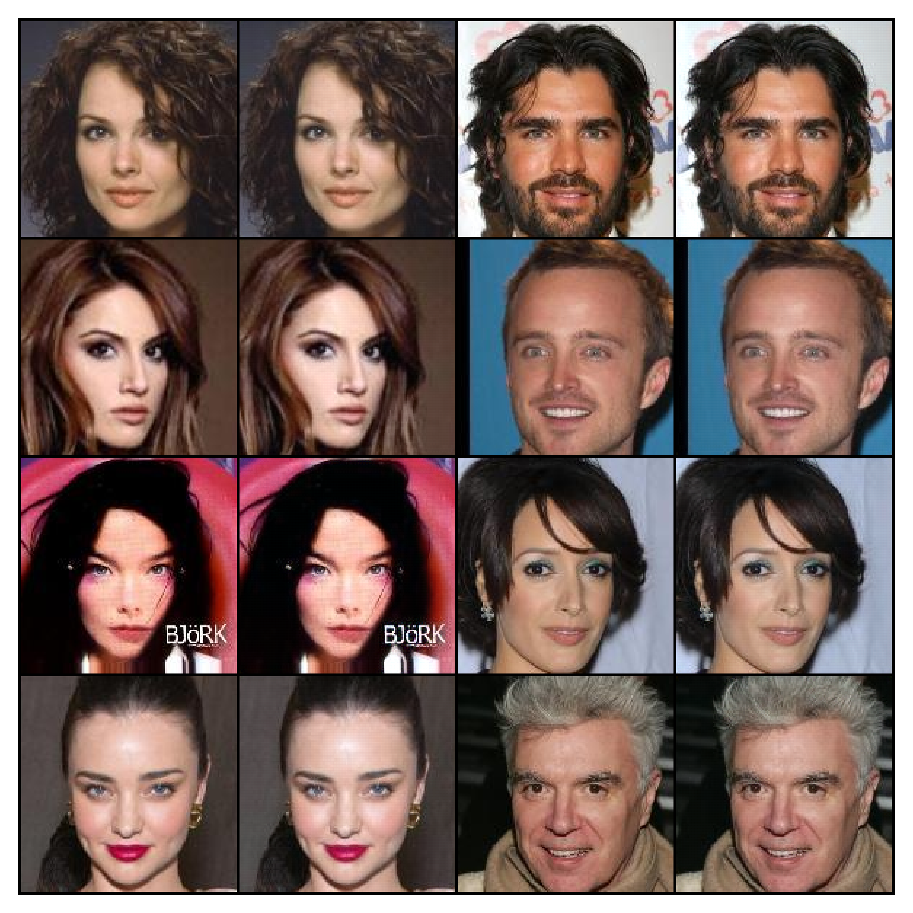
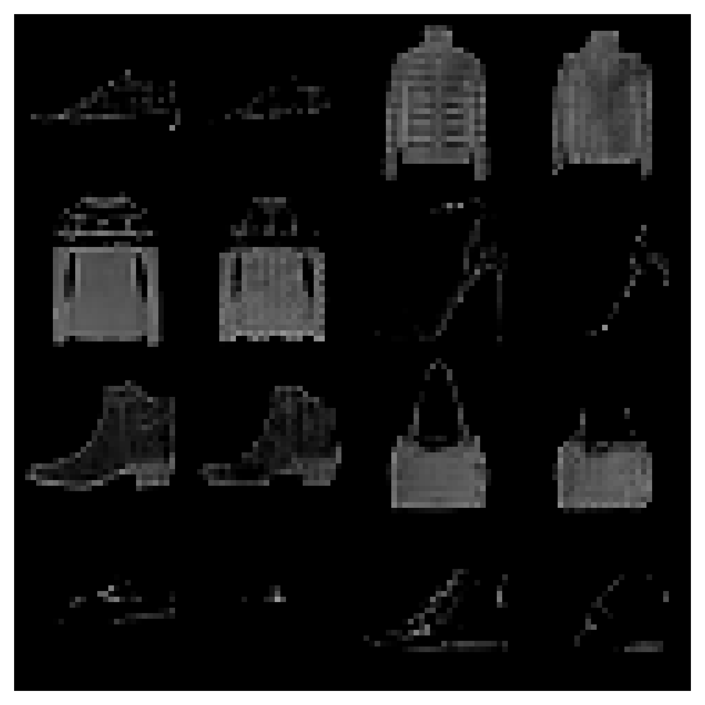
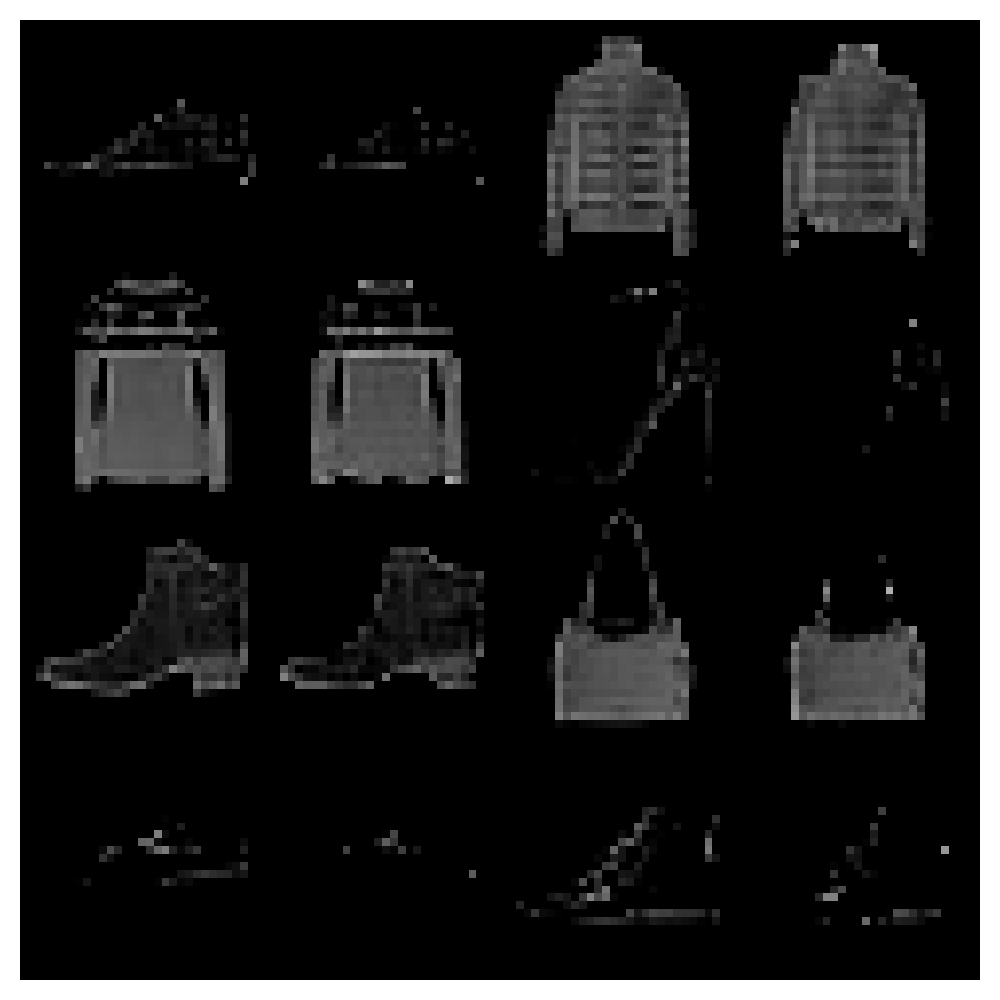

# LL-VQ-VAE
This repo is the official implementation of [LL-VQ-VAE: Learnable Lattice Vector-Quantization For Efficient Representations](https://arxiv.org/abs/2310.09382).


# Installation
To install the required packages run:
```
pip install -e .
```

You may need to download Celeb-A yourself, but FFHQ-1024 and FashionMNIST are automatically handled.

# Training
We include configs for all models. To train your own model run:
```
cd experiments
python train.py dataset='ffhq1024' quantizer='dense_lattice'
```

# Pretrained checkpoints
To evaluate a pretrained model you have to specify the dataset and quantizer types as so:
```
python evaluate_checkpoint.py dataset='ffhq1024' quantizer='dense_lattice'
```

We include pretrained checkpoints for all datasets and quantizer types in the `pretrained` directory. We also showcase the results below. 

The "Effective codebook size" is calculated by quantizing the entire dataset and counting the number of unique quantized vectors. This method was used since: (1) the lattice codebook isn't stored explicitly and (2) to demonstrate the codebook collapse issue faced with vanilla vector quantization.

You'll notice that we do not compute the codebook size for the dense lattice quantizer as the quantizer assigns each vector to a unique codebook entry, so the codebook size is equal to the number of vectors in the dataset. This is why the dense lattice reconstructions are superior to the other quantizers as it effictively has an "infinite" codebook size (doesn't really quantize).

For all results below the desired codebook size is 512. The learnable lattice uses that number to initialize its structure; however, the codebook size is not fixed and can grow or shrink during training.

| Dataset      | Quantizer       | Reconstruction                                                                         | Effective codebook size | Number of quantized vectors |
|--------------|-----------------|----------------------------------------------------------------------------------------|:-----------------------:|:---------------------------:|
| FFHQ-1024    | VQ-VAE          |                             |            28           |        4,587,520,000        |
| FFHQ-1024    | LL-VQ-VAE       |            |           231           |        4,587,520,000        |
| FFHQ-1024    | Dense LL-VQ-VAE |               |      4,587,520,000      |        4,587,520,000        |
| Celeb-A      | VQ-VAE          |                                 |            19           |        1,000,120,212        |
| Celeb-A      | LL-VQ-VAE       |                |           858           |        1,000,120,212        |
| Celeb-A      | Dense LL-VQ-VAE |                   |      1,000,120,212      |        1,000,120,212        |
| FashionMNIST | VQ-VAE          |                   |            17           |          11,760,000         |
| FashionMNIST | LL-VQ-VAE       |  |           457           |          11,760,000         |
| FashionMNIST | Dense LL-VQ-VAE |     |        11,760,000       |          11,760,000         |

# Contribution
Please feel free to open an issue or submit a pull request if you have any questions or suggestions :D. I'm sorry for any bugs you may face and will try to fix them as soon as possible.

# License
This project is licensed under the MIT License. See the [LICENSE](LICENSE) file for details.

# Citation
If you find this work useful to your research please consider citing our paper:
```
@article{khalil2023ll,
  title={LL-VQ-VAE: Learnable Lattice Vector-Quantization For Efficient Representations},
  author={Khalil, Ahmed and Piechocki, Robert and Santos-Rodriguez, Raul},
  journal={arXiv preprint arXiv:2310.09382},
  year={2023}
}
```